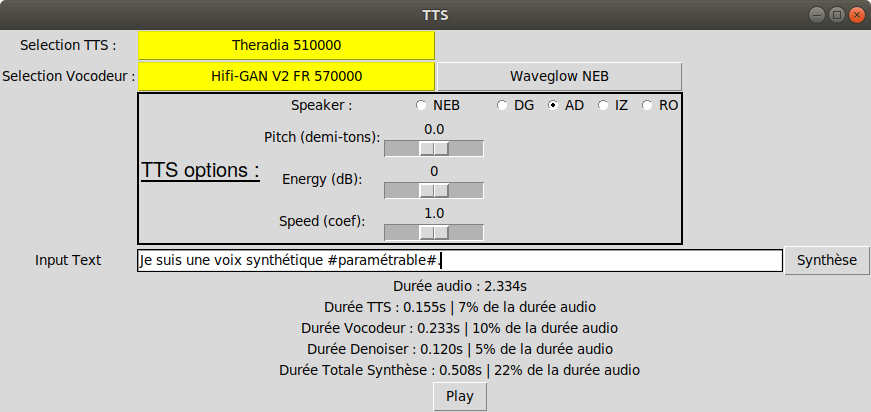

# Interface TTS en temps réel sur CPU (démo)

Cette interface permet de générer des synthèses en temps réel en combinant un TTS et un vocodeur à l'état de l'art. Par défaut, cette interface combine un FastSpeech2 avec Hifi-GAN.

# Installation

L'installation a été testée dans les environnements python 3.8 et 3.10. Le document compressé contient déjà les modèles pré-entrainés. Le fichier de configuration est adapté à ces modèles.

## Créer un environnement virtuel

Créer l'environnement

```
python.exe -m venv python3.11.1_embedded_tts
```

Activer l'environnement
```
python3.11.1_embedded_tts\Scripts\activate
```

Mettre à jour pip et les dépendances de base
```
python.exe -m pip install --upgrade pip
pip install --upgrade setuptools
```

## Dependencies
Le fichier requirements.txt permet d'installer les packages nécessaires.
```
pip3 install -r requirements.txt
```
Il est possible qu'une commande supplémentaire soit nécessaire pour installer les dépendances de l'interfaces graphique.
```
apt-get install python-tk
pip3 install python3-tk
```

## Modèles pré-entrainés et configuration
Pour utiliser les modèles pré-entrainés FastSpeech2, FlauBERT, HiFi-GAN et Waveglow, téléchargez les depuis les liens Google Drive suivants :
- [FastSpeech2](https://drive.google.com/drive/folders/13kLu5UwwTRH3hCyD8EcTwkl4aHosffy4?usp=sharing) : Téléchargez et dézippez les trois archives (config, output et preprocessed_data) dans le dossier assets/models/FastSpeech2
- [FlauBERT](https://drive.google.com/drive/folders/1yJ7jMCbP0fstVrCar7bKAO3uTBAgjCel?usp=sharing) : Téléchargez et dézipper le modèle et les fichiers de configuration dans assets/models/flaubert/flaubert_large_cased
- [HiFi-GAN](https://drive.google.com/drive/folders/1q4-gRK0QqIYT7PImVczYhi9yN4YG7OYC?usp=sharing) : Téléchargez et dézippez l'archive FR_V2 dans assets/models/hifi-gan-master
- [Waveglow](https://drive.google.com/drive/folders/1XhpZDhUWTw3EzKxclAnFMfAp9ZQ4NV8t?usp=sharing) : Téléchargez le modèle et placez le dans assets/models/Waveglow


# Quickstart

Le fichier de configuration est pré-rempli avec les paramètres recommandés.

## Sans interface graphique

```
python3 do_tts.py
```

Le script charge automatiquement les modèles par défaut FastSpeech2 (voix AD) et Hifi-GAN V2 (Entrainé sur du Français puis fine-tuné sur des spectres multi-locuteurs générés avec FastSpeech2). Lorsque les modèles sont chargés, un champ texte permet de saisir la phrase à synthétiser. Les arguments optionnels --default_tts et --default_vocoder permettent de sélectionner les modèles à pré-charger.

Le modèle accepte des entrées orthographiques et/ou phonétiques. Le signe # ajouté autour d'un mot permet d'ajouter de l'emphase sur celui-ci.
exemple : Bonjour, je suis un avatar #virtuel#.

Attention : pour préciser une entrée phonétique, la segmentation par mot doit être respectée et chaque mot doit être encapsulé dans des accolades.
exemple : Bonjour, je m'appelle {s y z i}.

L'alphabet phonétique utilisé est précisé dans ce [lien](https://zenodo.org/record/4580406#.YuPwJnhByV4).

Note : pour créer un continuité entre les phrases, les modèles sont entrainés avec une ponctuation initiale (exemple : .Bonjour, je m'appelle {s y z i}.). Cependant, pour faciliter la saisie, une ponctuation initiale par défaut est automatiquement ajoutée avant la synthèse. Il n'est donc plus nécessaire de commencer les phrases par une ponctuation. De même, pour faciliter la saisie en conservant une qualité de synthèse optimale, une ponctuation finale est automatiquement ajoutée si la phrase n'en contient pas.

## Avec interface graphique

```
python3 do_tts.py --gui
```

L'argument --gui permet d'utiliser l'interface graphique.



Un TTS et un vocodeur par défaut se chargent à l'ouverture de l'interface (surlignés en jaune). Pour sélectionner un autre TTS ou un autre vocodeur, cliquez sur le bouton correspondant. Le modèle précédente est dé-chargé avant de charger le nouveau (ce processus peut prendre quelques secondes en fonction de la taille des modèles).

En fonction du modèle, des champs supplémentaires apparaissent pour fournir quelques options de contrôle. Plusieurs choix de locuteurs sont disponibles. Des sliders permettent de modifier le pitch, l'énergie ou la vitesse d'élocution du modèle. Pour les modèles expressifs, des boutons radio permettent de choisir le style à appliquer.

Le champ texte permet de saisir le texte à synthétiser. De même, il est possible de combiner entrées orthographiques et/ou phonétiques. Cliquer sur le bouton "Synthèse" ou appuyer sur la touche "Entrée" lance la synthèse de la phrase par le TTS puis le vocodeur. La synthèse est automatiquement jouée quand elle est terminée, et peut être rejouée avec le bouton "Play".

Les durées d'inférence sont affichées automatiquement après la synthèse. 

# Utilisation des balises

Certaines caractères sont automatiquement reconnues pour paramètrer la synthèse.

## Balise de Locuteur : <SPEAKER=*>

La balise \<SPEAKER=* \> permet de spécifier le locuteur avec lequel générer le texte. Cette balise peut être ajoutée à n'importe quel emplacement dans la phrase. Si le locuteur précisé par cette balise existe dans le modèle choisi, celui-ci remplacera le locuteur par défaut. Si ce locuteur n'existe pas, la balise n'aura pas d'effet, et le locuteur par défaut sera utilisé. Veuillez à respecter la typographie \<SPEAKER=* \>, sans espace entre < et SPEAKER ni entre SPEAKER et =, et SPEAKER en majuscules.

## Balise de Style : <STYLE=*>

La balise \<STYLE=* \> permet de spécifier le style à employer pour générer le texte. Cette balise peut être ajoutée à n'importe quel emplacement dans la phrase. Cette balise n'a d'effet que pour les modèles expressifs. Si le style précisé par cette balise existe dans le modèle choisi, celui-ci remplacera le style par défaut. Si ce style n'existe pas, la balise n'aura pas d'effet, et le style par défaut sera utilisé. Veuillez à respecter la typographie \<STYLE=* \>, sans espace entre < et STYLE ni entre STYLE et =, et STYLE en majuscules.

Le style doit être écrit en majuscules et sans accents. La liste des styles possibles et la suivante :

- COLERE
- DESOLE
- DETERMINE
- ENTHOUSIASTE
- ESPIEGLE
- ETONNE
- EVIDENCE
- INCREDULE
- PENSIF
- RECONFORTANT
- SUPPLIANT
- NARRATION

## Balise de d'Intensité de Style : <STYLE_INTENSITY=*>

La balise \<STYLE_INTENSITY=* \> permet de spécifier l'intensité du style employé. Cette balise peut être ajoutée à n'importe quel emplacement dans la phrase. Cette balise n'a d'effet que pour les modèles expressifs. L'intensité du style peut varier entre 0 (pas expressif = style NARRATION) et 1 (très expressif). Les valeurs décimales doivent être écrites avec un point et non une virgule. Exemple :

    <STYLE_INTENSITY=0.6>

Si cette balise est utilisée, elle remplace l'intensité par défaut du style sélectionné. Les valeurs par défauts des styles sont choisies empiriquement pour produire des styles moins caricaturaux mais toujours facile à identifier :

- COLERE : 1.0
- DESOLE : 0.7
- DETERMINE : 0.8
- ENTHOUSIASTE : 0.7
- ESPIEGLE : 1.0
- ETONNE : 0.75
- EVIDENCE : 0.8
- INCREDULE : 1.0
- PENSIF : 0.7
- RECONFORTANT : 0.7
- SUPPLIANT : 0.8

Si la balise est utilisée avec le style "NARRATION", elle n'a pas d'effet. Veuillez à respecter la typographie \<STYLE_INTENSITY=* \>, sans espace entre < et STYLE_INTENSITY ni entre STYLE_INTENSITY et =, et STYLE_INTENSITY en majuscules. 

## Balise fin d'énoncé : §

La balise § fait la séparation entre les sous-énoncés, écrits dans une même entrée textuelle. Quand cette balise est utilisée, le modèle génère séparement les énoncés de part et d'autre de cette balise. Les synthèses (audio et visuelles) sont ensuite concaténées. L'utilisation de cette balise assure un silence d'environ 260ms dans la synthèse.

Il est possible d'utiliser les balises \<SPEAKER=* \>,  \<STYLE=* \> et \<STYLE_INTENSITY=* \> dans chaque sous-énoncé. Si une balise est utilisée dans un sous-énoncé, son effet est limité à ce sous-énoncé, et les paramètres par défaut seront appliqués dans les autres sous-énoncés.

L'exemple suivant génère un style différent pour chaque sous-énoncé, avec le locuteur par défaut :

    <STYLE=NARRATION>Bonjour, je suis Suzy, un avatar virtuel expressif.§<STYLE=NARRATION>Vous entendez actuellement ma voix neutre que j'utilise en #narration#.§<STYLE=ENTHOUSIASTE><STYLE_INTENSITY=0.6>Je peux aussi être {t r e z} #enthousiaste#, pour exprimer des félicitations.§<STYLE=PENSIF>Ou prendre un air #pensif#~§<STYLE=ETONNE>Je suis parfois #étonné# par ce que l'on me dit?§<STYLE=INCREDULE>Et si je doute~? je serai #incrédule#.§<STYLE=INCREDULE>Oui vraiment?§<STYLE=EVIDENCE>J'exprime parfois l'#évidence# de cette façon.§<STYLE=COLERE><STYLE_INTENSITY=0.9>Pour les reproches, je simulerai la #colère#.§<STYLE=ESPIEGLE>Je sais aussi détendre l'atmosphère, avec mon air #espiègle#.§<STYLE=RECONFORTANT>Pour remonter le moral, j'utiliserai un ton #réconfortant#.§<STYLE=DESOLE>Vous êtes triste?, j'en serai #désolé#.§<STYLE=DETERMINE>Je sais aussi être #déterminé#, je vous l'affirme.§<STYLE=SUPPLIANT>Ou #suppliant#, pour demander certaines choses.§

# Post-Traitements

Les paramètres "use_denoiser" et "visual_smoothing" dans le fichier "config_tts.yaml" permettent de spécifier l'utilisation d'un post-traitement pour les paramètres audio et visuels respectivement. Ce post-traitement permet de réduire le bruit audio produit par le vocodeur, ainsi que les tressautements de l'avatar. Le paramètre "cutoff" du "visual_smoothing" permet de régler le lissage. Une valeur plus faible (minimun 1) permet de lisser d'avantage au détriment de l'expressivité des mouvements de tête. Une valeur plus grande (maximum 5) laisse passer plus de mouvements. La valeur optimale est 3.

# Profilage

Un sous-système de profilage **optionnel** permet de mesurer le coût CPU/énergie de la synthèse, par phrase et par étage du pipeline (front-end FlauBERT, acoustique FastSpeech2, vocodeur Hifi-GAN, écriture audio). Il est désactivé par défaut (aucun fichier écrit, aucun surcoût) et se déclenche avec l'option `--profile`, la variable d'environnement `CHATTERBOX_PROFILE=1`, ou `profiling.enabled: true` dans `config_tts.yaml` :

```
python3 do_tts.py --profile
```

## Design : une seule horloge partagée

Trois composants, tous basés sur `time.monotonic()` pour rester synchronisables :

- **Échantillonneur en tâche de fond** (`tools/monitoring/profiling/sampler.py`) : tourne dans son propre processus (épinglé à un cœur CPU via `os.sched_setaffinity`, priorité abaissée via `os.nice`), et journalise à 10 Hz dans `profile/per_sample.csv` : utilisation CPU par cœur (`/proc/stat`), fréquence ARM (`scaling_cur_freq`), température (`thermal_zone0`), mémoire utilisée (`/proc/meminfo`), puissance PMIC (`vcgencmd pmic_read_adc` — la puissance **interne** totale, plus le détail par rail : voir "Puissance par rail PMIC" ci-dessous), l'état de throttling (`vcgencmd get_throttled`, échantillonné à 1 Hz seulement), et — si présent — la télémétrie du capteur **INA226** (voir ci-dessous). Nécessite un Raspberry Pi (Linux + sysfs + vcgencmd) ; sur un autre OS il est ignoré avec un avertissement, mais les marqueurs par phrase restent actifs.
- **Marqueurs dans le pipeline** (`tools/monitoring/profiling/recorder.py`, insérés dans `chatterbox/cli.py` et `chatterbox/synthesis/backends/fastspeech2_hifigan/backend.py`) : n'enregistrent que des horodatages `time.monotonic()` et quelques métadonnées légères, sans thread ni calcul lourd. Un enregistrement JSON par phrase est ajouté à `profile/per_sentence.jsonl` (id, texte, nombre de caractères/mots/phonèmes, horodatages de chaque étage, durées dérivées, durée audio, RTF).
- **Script de jointure hors-ligne** (`tools/monitoring/profiling/join.py`, non critique en temps) : combine `per_sample.csv` et `per_sentence.jsonl` pour produire `profile/per_sentence_results.csv` (énergie intégrée par trapèzes sur la fenêtre de chaque phrase, CPU moyen/pic, température pic, throttling, **et** énergie ampli/CPU/mémoire — voir ci-dessous) et `profile/per_stage_results.csv` (la même intégration sur chaque sous-fenêtre d'étage). Se lance avec :

```
python -m tools.monitoring.profiling.join
```

## Puissance par rail PMIC

`vcgencmd pmic_read_adc` expose un canal courant **et** un canal tension pour chaque rail interne mesuré (`3V7_WL_SW`, `3V3_SYS`, `1V8_SYS`, `DDR_VDD2`, `DDR_VDDQ`, `1V1_SYS`, `0V8_SW`, `VDD_CORE`, `0V8_AON`, `3V3_DAC`, `3V3_ADC`, `HDMI`), mais l'entrée 5V externe (`EXT5V_V`, ~5.12V) et le rail batterie (`BATT_V`) n'ont **que** la tension, pas de courant — il n'existe donc pas de lecture "puissance d'entrée" unique dans le PMIC : `pmic_power_w` (déjà journalisé) est la somme V×I sur les rails **explicitement listés** ci-dessus (`tools.monitoring.profiling.parsing.PMIC_RAILS`), c'est-à-dire la puissance **interne** du Pi (elle exclut les pertes de conversion des régulateurs et tout ce qui est tiré sur les broches GPIO 5V par des HAT externes). Le wattmètre USB-C externe (M1) reste donc la référence de puissance totale ; l'INA226 (M2) mesure l'amplificateur séparément.

- `cpu_power_w` : rail `VDD_CORE` (cœur CPU/GPU) seul.
- `mem_power_w` : somme `DDR_VDD2` + `DDR_VDDQ` + `1V1_SYS` (sous-système mémoire).
- `ext5v_v` : tension `EXT5V_V`, journalisée pour référence (pas de courant disponible sur ce rail).

Ces quatre colonnes (`pmic_power_w`, `cpu_power_w`, `mem_power_w`, `ext5v_v`) sont dérivées d'un **seul** appel `vcgencmd pmic_read_adc` par tick — le texte est parsé une fois (`tools.monitoring.profiling.parsing.parse_pmic_rails()`), puis chaque colonne en est extraite. `tools/monitoring/profiling/join.py` ajoute `cpu_energy_wh`/`cpu_mean_w` et `mem_energy_wh`/`mem_mean_w` à `per_sentence_results.csv` / `per_stage_results.csv`, à côté des colonnes système (`energy_j`/`energy_wh`, ...) et ampli (`amp_*`) existantes — utile pour voir, par étage du pipeline, si le coût est plutôt CPU ou plutôt mémoire.

## Capteur INA226 : puissance de la branche ampli

En complément du PMIC (qui mesure la consommation **système** globale du Pi), un capteur de courant/puissance **INA226** peut être câblé sur le bus I2C du Pi (`i2c-1`), à l'adresse **`0x40`**, avec un shunt de **2 mΩ**, sur la branche **5V qui alimente le breadboard de l'amplificateur**. Comme il est sur le bus I2C propre du Pi, l'échantillonneur le lit directement, dans la même boucle à 10 Hz, sur la même horloge partagée `time.monotonic()` — un seul run `--benchmark --play` mesure donc **simultanément** le coût de calcul (PMIC) et le coût de l'amplificateur (INA226).

- **Détection** : automatique au démarrage de l'échantillonneur (sondage I2C à `0x40`). Si le capteur est absent ou une lecture échoue, les colonnes restent vides (`NaN`/chaîne vide) — la synthèse et le reste du profilage ne sont jamais perturbés. Peut être désactivé explicitement avec `--no-ina` (`tools/monitoring/profiling/sampler.py`) ou `profiling.ina226: false` dans `config_tts.yaml` / `--no-ina` sur `do_tts.py`.
- **Câblage / vérification** : avant de lancer une session, vérifier qu'aucune collision d'adresse I2C n'existe avec le DAC IQaudio (`0x4c`) :

```
i2cdetect -y 1
```

  L'INA226 doit apparaître à `0x40`, le DAC IQaudio à `0x4c` — deux adresses distinctes sur le même bus `i2c-1`.

- **Colonnes ajoutées à `profile/per_sample.csv`** : `ina_bus_v` (tension bus, V), `ina_current_a` (courant, A), `ina_power_w` (puissance, W). Vides si le capteur n'est pas présent.
- **Colonnes ajoutées par `tools/monitoring/profiling/join.py`** à `per_sentence_results.csv` / `per_stage_results.csv` : `amp_energy_j` / `amp_energy_wh` (énergie ampli intégrée sur la fenêtre, par trapèzes, comme pour le PMIC) et `amp_mean_w` / `amp_peak_w` (puissance ampli moyenne/pic). Ces colonnes sont **à côté** des colonnes système existantes (`energy_j`, `energy_wh`, ...) dérivées du PMIC — chaque phrase rapporte donc l'énergie **système** et l'énergie **ampli** côte à côte, sans que l'une modifie l'autre. Aucune calibration n'est appliquée à la lecture INA226 (contrairement au PMIC) : c'est une lecture de courant/tension directe, pas un proxy à recaler sur un wattmètre externe.

## Calibration PMIC

La puissance lue via `vcgencmd pmic_read_adc` inclut la consommation du profileur lui-même. Pour la recaler sur un wattmètre USB-C externe :

```
python -m tools.monitoring.profiling.calibrate --seconds 30
```

À exécuter à quelques états stables (repos, charge moyenne), en notant la moyenne affichée en face de la lecture du wattmètre externe au même instant. Ajuster une droite `puissance_wattmètre = scale * pmic_power_w + offset` et enregistrer le résultat dans `profile/calibration.json` (`{"scale": ..., "offset": ...}`), appliqué automatiquement par `tools/monitoring/profiling/join.py`. Il est aussi recommandé de mesurer une fois la consommation à vide du profileur (échantillonneur lancé seul, synthèse à l'arrêt) pour connaître son propre surcoût sur la mesure PMIC.

# Benchmark

Un mode routine permet de synthétiser automatiquement un jeu fixe de 10 phrases françaises (`tools/measurement/benchmark/sentences_fr.jsonl`), avec le profilage activé, pour comparer la puissance et le RTF selon la longueur et la complexité des phrases. Il réutilise exactement le même appel de synthèse que le mode texte libre (`chatterbox.cli.syn_audio()`) — aucune synthèse dupliquée.

```
python3 do_tts.py --benchmark [--play] [--repeats N] [--join] [--export-xlsx] [--sentences FICHIER]
```

- Sans `--benchmark`, le comportement est **inchangé** : mode texte libre interactif.
- `--benchmark` déroule REF → A1 → A2 → A3 → B1 → B2 → B3 → B4 → C1 → C2 → REF (REF encadre le jeu au début et à la fin, pour détecter une dérive d'une exécution à l'autre), avec une pause silencieuse fixe de 2 s entre chaque synthèse (pour garder des paliers de repos nets dans `profile/per_sample.csv`, utiles pour découper le signal de puissance et soustraire une ligne de base par phrase). `--benchmark` active automatiquement le profilage (équivalent à `--profile`).
- `--play` : joue aussi l'audio après chaque synthèse (nécessaire pour une mesure acoustique/ampli). Par défaut, synthèse seule (isole le coût de calcul).
- `--repeats N` : répète l'ensemble ordonné N fois (statistiques).
- `--sentences FICHIER` : remplace le jeu de phrases par défaut par un autre fichier JSONL (même format).
- `--join` : une fois le benchmark terminé et le profileur arrêté, lance `tools/monitoring/profiling/join.py` pour produire `profile/per_sentence_results.csv` et `profile/per_stage_results.csv`.
- `--export-xlsx` : en plus du join (implicite), exporte vers une feuille Excel prête à coller — voir "Export Excel" ci-dessous.

## Export Excel

`tools/measurement/benchmark/export_to_xlsx.py` (nécessite `pip install openpyxl`, dépendance optionnelle chargée à la demande) lit `profile/per_sentence_results.csv` / `profile/per_stage_results.csv` et écrit **`profile/exports/chatterbox_paste.xlsx`** — un dossier dédié aux exports, distinct des CSV bruts.

```
python3 do_tts.py --benchmark --play --export-xlsx
# ou, après un --join déjà fait :
python -m tools.measurement.benchmark.export_to_xlsx [--profile-dir profile] [--out-dir profile/exports]
```

- Une feuille `P2P3_Synthesis` par passage complet de 11 phrases (`REF_start, A1, A2, A3, B1, B2, B3, B4, C1, C2, REF_end`), colonnes A-U dans l'ordre exact attendu par le classeur maître `Chatterbox_Power_Measurements_final.xlsx` (feuille `P2P3_Synthesis`, collage en `A12`) : `id, tag, words, phon, audio_s, synth_ms, RTF, front_ms, acou_ms, voco_ms, write_ms, pmicE_Wh, synthP_W, E/s_Wh, ampE_Wh, ampMean_mW, ampPk_mW, peak_C, throttled, cpuE_Wh, cpuP_W`. En-têtes en ligne 1, données en lignes 2 à 12 — copier `A2:U12` et coller dans le classeur maître.
- **Avec `--repeats N`** (plusieurs passages), chaque passage complet obtient sa **propre feuille** : le premier reste nommé `P2P3_Synthesis` (collage direct possible), les suivants `P2P3_Synthesis_pass2`, `P2P3_Synthesis_pass3`, ... (même disposition `A2:U12`). Un passage incomplet (exécution interrompue) est ignoré avec un avertissement plutôt que d'écrire une feuille partielle.
- Toutes les valeurs sont des nombres **littéraux**, pas des formules — la feuille collée est autonome. Les colonnes dérivées (`RTF`, `synthP_W`, `E/s_Wh`, `cpuP_W`) sont recalculées par le script à partir des colonnes du join, pas recopiées telles quelles.
- Une feuille `per_stage` supplémentaire (référence, pas destinée au collage) liste, par phrase et par étage, la durée (ms) et l'énergie totale/CPU/mémoire (Wh).
- Sans capteur INA226 ou sans certains rails PMIC, les colonnes correspondantes restent simplement vides — l'export ne plante jamais pour une donnée manquante.
- Si `openpyxl` n'est pas installé, l'export imprime `pip install openpyxl` et s'arrête proprement (les CSV du join restent intacts).

## Format de `tools/measurement/benchmark/sentences_fr.jsonl`

Un objet JSON par ligne : `id` (identifiant court), `text` (phrase à synthétiser), `tag` (étiquette de complexité, reportée dans l'enregistrement de profilage par phrase), `word_count` (nombre de mots, métadonnée descriptive).

Le jeu est construit pour isoler un facteur à la fois :
- **A1–A3** font varier la longueur à faible complexité (`short_plain`/`medium_plain`/`long_plain`) ;
- **B1–B4** font varier un seul facteur de stress à la fois : liaisons (B1), nombres en toutes lettres (B2), prosodie/ponctuation (B3), nom propre + acronyme (B4) ;
- **C1–C2** cumulent plusieurs facteurs (nombres empilés ; homographes hétérophones nécessitant une bonne conversion grapheme-to-phoneme) ;
- **REF** ancre le jeu en début et fin d'exécution pour détecter une dérive (échauffement CPU, throttling, ...).

# P4 : balayage de cadence

Le dernier volet des expériences de puissance : mesure comment la puissance système moyenne `P_use` varie avec le débit conversationnel (énoncés/minute), pour produire une formule `P_use(N) = P_idle + k·N` convertissant n'importe quel modèle d'usage en budget d'énergie journalier. Réutilise exactement le même appel de synthèse+lecture que `--benchmark` (`chatterbox.cli.syn_audio()`) et les mêmes `profiling`/`join` — aucune logique de synthèse dupliquée.

```
python3 do_tts.py --p4-sweep --cadences 0,1,2,5,10,max --duration 600
```

- `--cadences` : liste d'énoncés/minute séparés par des virgules. `0` = ancre idle pure (aucune synthèse). `max` = enchaînement sans pause (mesure la cadence réellement atteignable).
- `--duration` : secondes par point de cadence (défaut 600).
- `--p4-sweep` active automatiquement le profilage et joue systématiquement l'audio, quels que soient `--play`/`--profile` (acceptés sans effet, pour compatibilité avec les autres modes).

**Déroulement par point** : affichage de l'en-tête du point → invite « Reset the meter's mWh totaliser now, then press Enter to start... » → la boucle de synthèse tourne pendant `--duration` secondes à la cadence demandée (chaque cycle synthétise + joue une phrase du jeu `tools/measurement/benchmark/sentences_fr.jsonl`, bloquant, puis patiente le temps restant du créneau ; `max` enchaîne sans pause) → arrêt du profileur, jointure → invite « Read the totaliser. Enter mWh (blank to skip): » → la ligne du point est **ajoutée immédiatement** à `sweep_summary.csv` (un balayage dure facilement une heure sans surveillance entre les points ; un Ctrl-C tardif ne doit pas faire perdre les points déjà terminés).

**Sortie** :
```
profile/p4_sweep_YYYYMMDD_HHMMSS/
    cadence_00/     (per_sample.csv, per_sentence.jsonl, *_results.csv, meta.json)
    cadence_01/
    ...
    sweep_summary.csv
    sweep_paste.xlsx
```

`sweep_summary.csv` contient une ligne par point (cadence demandée/atteinte, temps de synthèse/lecture, taux d'occupation, énergie/puissance calculées par le profileur **sur toute la fenêtre du point** — pas seulement les fenêtres de synthèse actives, pour englober correctement le point `cadence=0` qui n'a aucune phrase — et la lecture du wattmètre externe). En fin de balayage, un ajustement linéaire `P_use = P_idle + k·N` est imprimé et sauvegardé, calculé séparément pour la série profileur et la série wattmètre (contre `cadence_achieved`, pas `cadence_requested`), avec un signal si `R² < 0,95` ou si l'ordonnée à l'origine ajustée diffère de plus de 5 % du point `cadence=0` mesuré directement.

`sweep_paste.xlsx` produit un bloc prêt à coller (`A2:P<n+1>`, valeurs littérales) dans la feuille `P4_Conversational` du classeur maître, avec exactement les 16 colonnes de son en-tête (`A:P`) : `cadence_req | cad_achiev | dur_h | n_utt | totalis_Wh | P_use_met_W | P_use_prof_W | discrep_% | duty_synth | duty_play | duty_active | amp_mean_W | cpu_mean_W | mem_mean_W | peak_C | throttled`. `P_use_met_W` et `P_use_prof_W` sont deux colonnes séparées (pas de repli implicite) : si la lecture du wattmètre a été passée pour un point, `P_use_met_W` reste vide pour ce point plutôt que d'être silencieusement remplacée par la valeur du profileur.

**Re-calculer sans relancer une mesure** (par ex. après correction manuelle d'une lecture de wattmètre dans `sweep_summary.csv`) :
```
python -m tools.measurement.benchmark.p4_sweep --refit profile/p4_sweep_20260716_120000
```

**⚠️ Validité de la calibration** : la calibration PMIC→wattmètre (`profile/calibration.json`, voir "Calibration PMIC" ci-dessus) n'est valable que dans les conditions où elle a été établie — écran **allumé, à la luminosité de calibration**, amplificateur alimenté. Ces deux conditions doivent rester **fixes pendant tout le balayage** (le script invite une fois à noter la luminosité dans `meta.json`, à titre de rappel, mais ne peut pas la vérifier automatiquement) ; tout changement en cours de balayage invalide silencieusement `energy_wh_profiler`/`p_use_profiler_w` pour les points suivants — la lecture du wattmètre externe reste la référence dans ce cas.

Note structurelle : le wattmètre est remis à zéro juste avant le lancement du profileur (et lu juste après son arrêt), donc sa fenêtre de mesure est toujours légèrement plus large que celle du profileur (premières/dernières millisecondes d'échantillonnage) — une source de `discrepancy_pct` de quelques pourcents, inhérente et non corrigeable sans modifier ce protocole humain-dans-la-boucle.

# Performances

Avec les paramètres recommandés (FastSpeech2 + Hifi-GAN V2), la durée d'inférence est d'environ 20% de la durée d'audio sur CPU.

Les différentes voix de FastSpeech ne modifient par le temps d'inférence. 4 voix de femmes sont disponibles : [NEB, AD, IZ, RO], ainsi qu'une voix d'homme : [DG].

Pour une synthèse audio-visuelle, AD est recommandée.

# Sortie visuelle

Pour le moment, la sortie audio est la seule gérée par l'interface. Cependant, un fichier .AU est généré avec les 37 paramètres visuels (échantillonnés à ~86Hz = 22050/256). Ce fichier garde le format utilisé jusqu'à maintenant (4 entiers 32 bits en entête pour préciser le nombre d'échantillons, le nombre de paramètres visuels, le numérateur de la fréquence d'échantillonnage et le dénominateur de la fréquence d'échantillonnage, suivis par la matrice des paramètres). Ce fichier peut être utilisé pour générer les mouvements de l'avatar.

Les fichiers .wav et .AU sont créés à la racine de ce dossier, avec les noms "audio_file.wav" et "audio_file.AU"